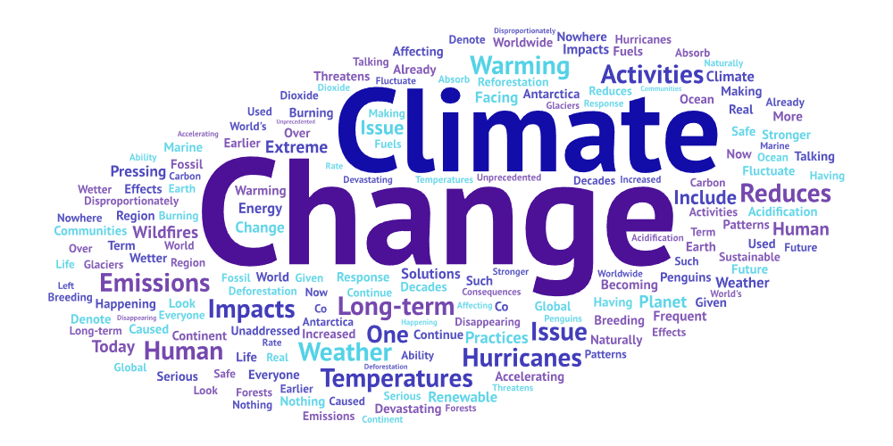
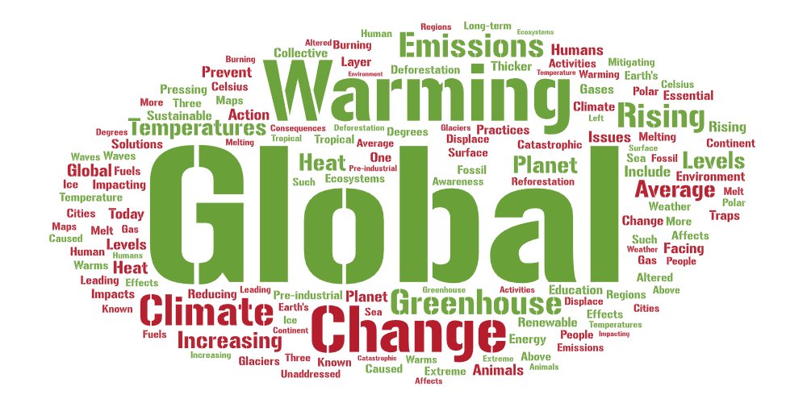
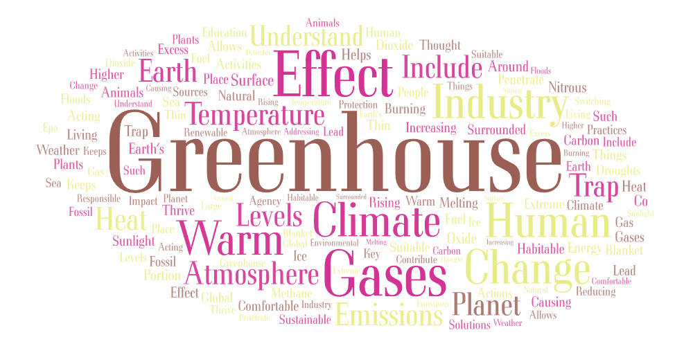

# Lab 02: Web Data Collection and Visualization
## 1. Topic & Parameters:
- Topic Keywords: "climate change", "global warming", "greenhouse gases"
- Platform: YouTube
- Data collected:
    - 'video_url': Url link of video
    - 'user_url': Url link of user
    - 'username': YouTube username
    - 'title': Video title
    - 'view_num': Number of views
    - 'created_at': Time the video was created
    - 'shortdesc': Short description of the video
    - 'collected_at': When the video was collected by crawler
## 2. Purpose of Comparison:
I wanted to compare these three different search terms to see how the data collected compared to each other because they all emphasize the same topic but can have different connotations/understandings. 
## 3. Word Cloud Comparison
### Climate Change

### Global Warming

### Greenhouse Gases

### Overall Comparison

## Pattern Reasoning

## Future Research Improvement

## Unexpected Findings

## CSV Files:
- [Climate Change Search Results](assets/search-result-1.csv)
- [Global Warming Search Results](assets/search-result-2.csv)
- [Greenhouse Gases Search Results](assets/search-result-3.csv)
